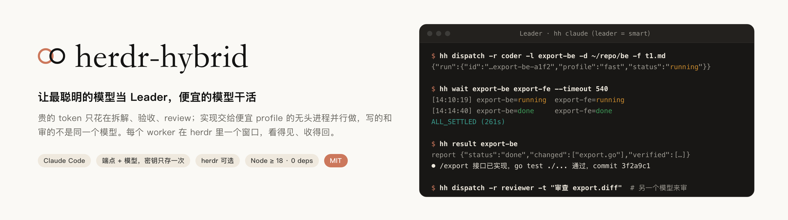
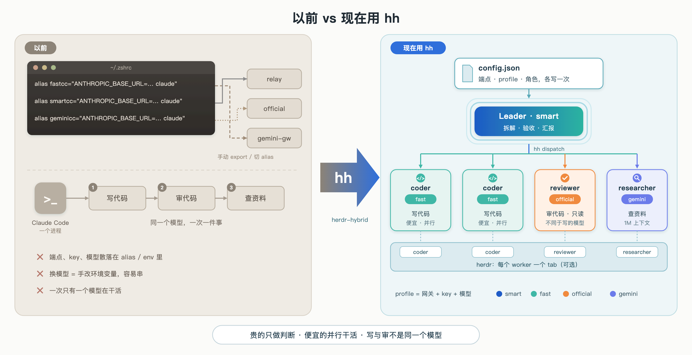
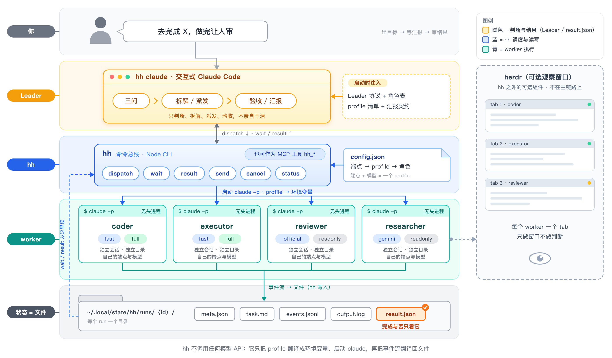
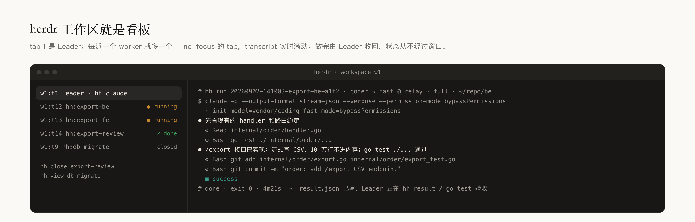
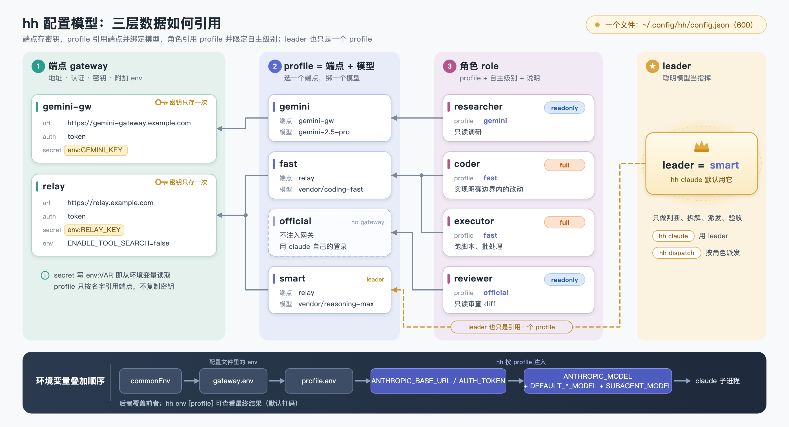
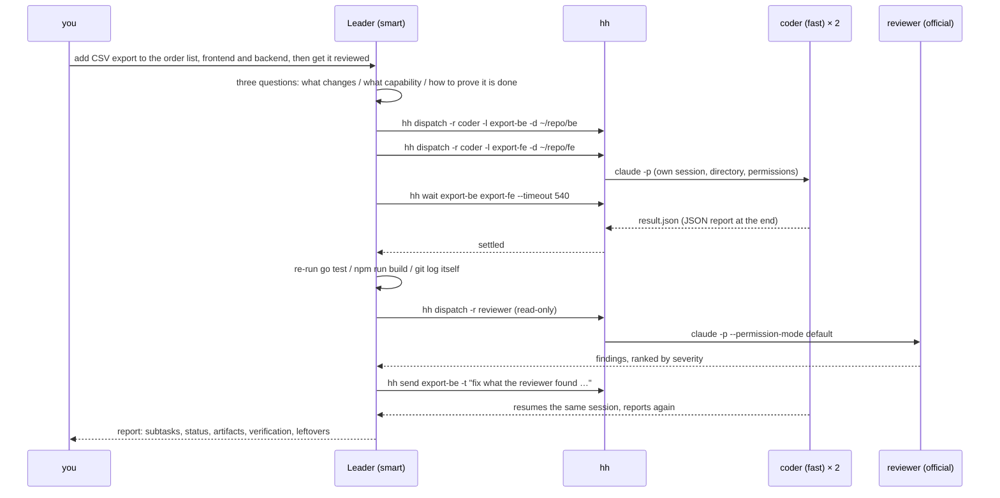
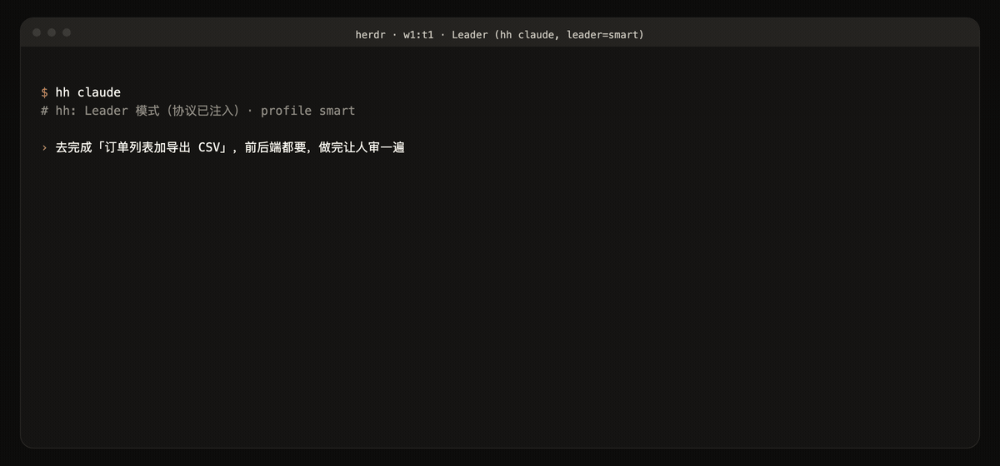

<p align="center">
  <picture>
    <source media="(prefers-color-scheme: dark)" srcset="docs/assets/banner-dark.png">
    
  </picture>
</p>

<p align="center">
  <strong>Let your smartest model lead. Let the cheap ones build.</strong><br>
  Hybrid orchestration for Claude Code: every subscription, API key and gateway in one config; different models write, review and research each other's work; a Leader that plans and verifies; workers that build in parallel; one herdr tab per worker.
</p>

<p align="center">
  <a href="#why-hybrid">Why hybrid</a> ·
  <a href="#how-it-works">How it works</a> ·
  <a href="#why-herdr">Why herdr</a> ·
  <a href="#get-started">Get started</a> ·
  <a href="#showcase">Showcase</a> ·
  <a href="#config">Config</a> ·
  <a href="README.md">中文</a>
</p>

<br>

## Why hybrid

If you hold several subscriptions, API keys or gateways, this is probably how you use Claude Code today:

<p align="center"></p>

| Before | With hh |
| --- | --- |
| **Endpoints scattered across aliases**: `fastcc`, `smartcc`, `geminicc`… each a hand-copied URL, secret and model; nothing can script or orchestrate them | **One `config.json`**: endpoint, secret and model written once; `hh claude fast` to launch, `hh dispatch -p fast` to delegate; old aliases import in one step |
| **Stuck with one vendor at a time**: the model that writes the code also reviews it and researches for it, and never catches its own mistakes | **Cross-model development and review by default**: coder on cheap vendor A, reviewer on vendor B read-only, researcher on long-context vendor C |
| **One thing at a time**: frontend waits for backend, review waits for implementation | **Parallel**: every subtask is its own process, session and directory; the Leader only waits for results |
| **The most expensive model types everything**: planning and typing burn the same tokens | **Expensive tokens only for judgement**: the Leader decomposes, verifies and reports; cheap profiles implement |
| **Trying another model = edit an alias, reopen a terminal, re-explain the context** | **`hh send` resumes the same session**; `-p` re-dispatches the same task to another profile for comparison |

Still Claude Code, no new toolchain: the Leader is an interactive Claude Code session, workers are headless `claude -p` processes, each carrying its own profile's endpoint and model.

## How it works

<p align="center"></p>

hh never calls a model API. It does three things: translate a profile into environment variables and `claude` arguments; launch Claude Code with them, interactive for the Leader and headless for workers; translate each worker's event stream back into a readable transcript and a machine-readable `result.json`. State lives only in files: one directory per run, and completion is decided by `result.json` and whether the process is alive.

The Leader works from principles, not keywords. At launch it receives the live role roster (who is good at what) and the profile list, then decides for every request what changes, what capability it needs and how completion will be proven. Workers end with a JSON report (files changed, verification commands run, assumptions); the Leader checks data, and follow-ups resume the same session.

Compared with Claude Code's built-in subagents (the Agent tool):

| | Built-in subagents | herdr-hybrid |
| --- | --- | --- |
| Models | Same account and endpoint; opus / sonnet / haiku only | Any endpoint, any model; one profile per role |
| Lifetime | Tied to the current session | Independent processes that outlive the Leader; `hh send` resumes the same session |
| Visibility | Folded into the chat | One herdr tab per worker, or `hh read` |
| Verification | The subagent's own word | JSON report plus the Leader re-running the checks |

With a single endpoint the built-in subagents are usually enough. This project assumes you have **two or more** and want the expensive one to judge while the cheap ones build.

## Why herdr

Headless processes are invisible. [herdr](https://herdr.dev) adds the window and nothing else:

- **One tab per worker** with the transcript scrolling live: which files it reads, which tools it calls, where it is stuck. Created with `--no-focus`, so your cursor stays put.
- **The workspace is the dashboard.** Tab 1 is the Leader; the rest are opened and closed by the Leader (`hh close`).
- **State never goes through the window.** Completion is decided by `result.json` and the process. Close a tab and nothing is lost; without herdr everything still runs, just unwatched.
- **Zero setup.** `hh claude` opens the Leader in a new herdr tab by default, starts the server if needed, and runs in place when you are already inside herdr. Without herdr it falls back to the current terminal and suggests `hh install herdr`. Opt out per launch with `hh claude --no-herdr`, or permanently with `hh viewer none`.

<p align="center"><picture>
    <source media="(prefers-color-scheme: dark)" srcset="docs/assets/herdr-dark.png">
    
  </picture></p>

## Get started

Three words: a **gateway** is an API URL plus its secret, stored once; a **profile** is gateway + model, and `hh claude <profile>` launches Claude Code with it; a **role** is a job for the Leader to hand out, pointing at a profile. `official` is the built-in profile meaning "whatever `claude` is logged in as".

<p align="center"></p>

The only hard requirement is Node ≥ 18. If Claude Code or herdr is missing, `install.sh` offers to install them with the official scripts (herdr is optional; `hh install herdr` any time).

```bash
git clone https://github.com/wangfan1998-github/herdr-hybrid.git && cd herdr-hybrid
./install.sh                                # hh → ~/.local/bin, Leader skill → ~/.claude/skills, offers Claude Code / herdr, runs hh init
```

**First configuration.** When `hh init` finds no endpoint it drops into `hh setup` (also runnable any time): a short Q&A adds one endpoint, asks whether it leads or works, and sends a real `pong` to check connectivity. Run it once per endpoint. The non-interactive equivalent:

```bash
hh gateways set relay --url https://relay.example.com --auth token --secret sk-xxx   # endpoint + secret (or env:VAR)
hh profiles set fast  --gateway relay --model vendor/coding-fast                     # endpoint + model = profile
hh profiles set smart --gateway relay --model vendor/reasoning-max
```

**Already keeping keys in shell aliases?** `hh init` imports them: lines like `alias fastcc="ANTHROPIC_BASE_URL=… ANTHROPIC_AUTH_TOKEN=… claude"` in `~/.shell_aliases`, `~/.zshrc` or `~/.bashrc` become profile `fast`, and aliases sharing a URL and secret collapse into one gateway.

Then assign, verify, launch:

```bash
hh roles set coder --profile fast           # cheap and fast does the work
hh roles set reviewer --profile official    # the writer is never the reviewer
hh leader smart                             # your smartest profile leads
hh doctor --net                             # real round trip for every profile a role uses
hh claude                                   # start the Leader: with herdr installed it opens in a new herdr tab, one tab per worker
hh claude --no-herdr                        # no windows: Leader stays in this terminal, workers run in the background
```

> **Default permissions**: `hh claude` passes `--dangerously-skip-permissions`, and the `full` autonomy of coder / executor maps to `--permission-mode bypassPermissions`. Workers get your full local rights; dispatch only into directories you trust, and tighten via `claude.interactiveArgs` and each role's `autonomy` (`workspace` / `readonly`).

## Showcase

One request, end to end, inside the Leader session: decompose → two coders in parallel → wait → re-run verification → review by a different model → follow-up in the same session → report. You only see the report.



The same loop as it actually looks in the Leader tab:

<p align="center"></p>

Real output; gateway and model names replaced with placeholders.

```text
$ hh dispatch -r coder -l e2e -d ~/work -t "Create ok.txt containing: hybrid works. Then reply: done"
run      20260902-172446-e2e-9e5c
role     coder → fast@relay(vendor/coding-fast) · full
launch   herdr tab w1:tT
status   ● running

$ hh wait 20260902-172446-e2e-9e5c
[17:24:48] 20260902-172446-e2e-9e5c=running
[17:25:18] 20260902-172446-e2e-9e5c=done
ALL_SETTLED (30s)
```

The worker's structured report:

```json
{ "status": "done", "summary": "created note.txt, verified",
  "changed": ["note.txt"], "commits": [],
  "verified": [{ "cmd": "cat note.txt", "ok": true }],
  "assumptions": ["not a git repo, nothing committed"], "blockers": [] }
```

Inside an agent's shell every command above returns JSON.

Granularity: even a trivial task takes a worker a minute or two (headless startup plus at least two turns). Dispatch subtasks of a few minutes to half an hour; a few-line change is faster done by the Leader itself, which the protocol also says.

## Config

`~/.config/hh/config.json` (mode 600):

```json
{
  "leader": "smart",
  "gateways": { "relay": { "url": "https://relay.example.com", "auth": "token", "secret": "env:RELAY_KEY" } },
  "profiles": {
    "official": { "gateway": null },
    "fast":     { "gateway": "relay", "model": "vendor/coding-fast" },
    "smart":    { "gateway": "relay", "model": "vendor/reasoning-max" }
  },
  "roles": {
    "coder":    { "profile": "fast",     "autonomy": "full",     "desc": "implement within a clear boundary, run verification, commit per file" },
    "reviewer": { "profile": "official", "autonomy": "readonly", "desc": "read-only diff review with severity-ranked findings" }
  }
}
```

A profile is gateway + key + model. Roles are data: any name, `desc` tells the Leader what it is for, `autonomy` maps to `--permission-mode`. Secrets live only in this file (or `env:VAR`) and are masked in every output.

Docs: [config](docs/config.md) · [profiles & report contract](docs/profiles.md) · [observability](docs/observability.md) · [troubleshooting](docs/troubleshooting.md) · [Leader protocol](skill/herdr-leader/SKILL.md)

<p align="center"><sub>Optional viewer built on <a href="https://herdr.dev">herdr</a> · README structure after <a href="https://github.com/0x0funky/agent-sprite-forge">agent-sprite-forge</a>, design guidance from <a href="https://github.com/pbakaus/impeccable">impeccable</a> · MIT</sub></p>
