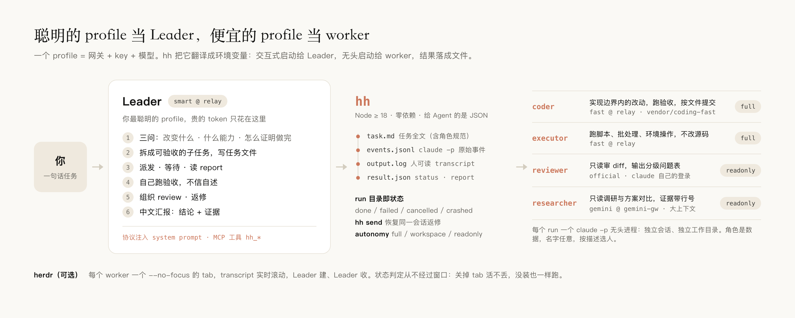
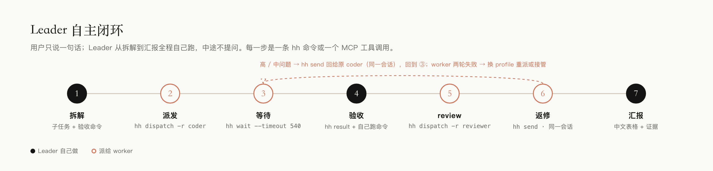

<p align="center">
  <picture>
    <source media="(prefers-color-scheme: dark)" srcset="docs/assets/banner-dark.png">
    
  </picture>
</p>

<p align="center">
  <strong>让你最聪明的模型当 Leader，便宜的模型干活。</strong><br>
  Claude Code 的混动编排：多家订阅 / API key / 网关一份配置；不同模型交叉开发、交叉 review；Leader 拆解、验收、汇报，worker 并行实现；每个 worker 在 herdr 里一个窗口。
</p>

<p align="center">
  <sub>Hybrid orchestration for Claude Code: every subscription, API key and gateway in one config; different models write, review and research each other's work; a Leader that plans and verifies, workers that build in parallel; one herdr tab per worker.</sub>
</p>

<p align="center">
  <a href="https://github.com/wangfan1998-github/herdr-hybrid/actions/workflows/ci.yml"></a>
  
  
  
  
  <a href="LICENSE"></a>
</p>

<p align="center">
  <a href="#为什么混动">为什么混动</a> ·
  <a href="#加上-herdr看得见的团队">加上 herdr</a> ·
  <a href="#上手">上手</a> ·
  <a href="#跑起来是什么样">Showcase</a> ·
  <a href="#你可以这样说">提示语</a> ·
  <a href="#配置">配置</a> ·
  <a href="README.en.md">English</a>
</p>

<br>

## 为什么混动

手里有几家订阅、API key 或网关的人，大多是这么用 Claude Code 的：

| 以前 | 现在用 hh |
| --- | --- |
| **端点散在一堆 alias 里**：`fastcc` `smartcc` `geminicc`……每条手抄一遍地址、密钥、模型，脚本读不到，编排不了 | **一份 `config.json`**：端点、密钥、模型各写一次；`hh claude fast` 启动，`hh dispatch -p fast` 派发；旧 alias 一键导入 |
| **只能一直用一家**：写代码、审代码、查资料是同一个模型，自己审自己看不出问题 | **交叉开发、交叉 review 是默认行为**：coder 用便宜的 A 家，reviewer 用另一家只读审，researcher 用大上下文的 C 家 |
| **一次只做一件事**：前端等后端，review 等实现 | **并行**：每个子任务一个独立进程、独立会话、独立目录，Leader 只等结果 |
| **最贵的模型从头写到尾**：规划和搬砖烧同一份 token | **贵的只做判断**：Leader 拆解、验收、汇报；实现、跑脚本交给便宜的 |
| **换个模型试试 = 改 alias、重开终端、重讲一遍上下文** | **`hh send` 接着同一会话返修**；`-p` 换个 profile 重派同一任务对照 |

还是 Claude Code，不换工具链：Leader 是一个交互式 Claude Code，worker 是一批 `claude -p` 无头进程，各自带着自己 profile 的端点和模型。

<p align="center">
  <picture>
    <source media="(prefers-color-scheme: dark)" srcset="docs/assets/architecture-dark.png">
    
  </picture>
</p>

Leader 靠原则工作，不靠关键词：启动时把当前真实的角色表（谁擅长什么）和 profile 清单注入 prompt，它按「这件事改变什么 / 需要什么能力 / 怎么证明做完了」三问决定派给谁、给多大权限、怎么验收。worker 结束时按契约交一份 JSON 报告（改了什么、跑了什么验收、有什么假设），Leader 拿数据核对，返修直接接着同一会话继续。

和 Claude Code 自带的子代理（Agent 工具）比：

| | 自带子代理 | herdr-hybrid |
| --- | --- | --- |
| 模型来源 | 同一个账号 / 端点，只能在 opus / sonnet / haiku 里选 | 任意端点、任意模型，每个角色一个 profile |
| 生命周期 | 跟着当前会话，会话结束就没了 | 独立进程，Leader 关了照跑；`hh send` 随时接着同一会话返修 |
| 可见性 | 折叠在对话里 | 每个 worker 一个 herdr tab，或 `hh read` |
| 验收 | 子代理自述 | JSON 报告 + Leader 自己复跑验收命令 |

只有一个端点的话，自带子代理多半够用；这个项目的前提是**你手里有两个以上**，想让贵的做判断、便宜的干活。

## 加上 herdr：看得见的团队

无头进程最大的问题是看不见。[herdr](https://herdr.dev) 补上这一块，而且只做窗口，不做判断：

- **每个 worker 一个 tab**，transcript 实时滚动：它在读什么文件、调什么工具、卡在哪。`--no-focus` 创建，不抢你的光标。
- **工作区就是看板**。tab 1 是 Leader，其余 tab 由 Leader 建、由 Leader 收（`hh close`）。想看细节点进去，不用在里面输入。
- **状态从不经过窗口**。完成与否只看 `result.json` 和进程；关掉 tab 活不丢，没装 herdr 一切照跑，只是没有窗口。`hh view` 随时给后台 run 补开一个。

<p align="center">
  <picture>
    <source media="(prefers-color-scheme: dark)" srcset="docs/assets/herdr-dark.png">
    
  </picture>
</p>

## 上手

三个词就够了：**端点**（gateway）= 一个 API 地址加它的密钥，只存一次；**profile** = 端点 + 模型，`hh claude <profile>` 就用它启动 Claude Code；**角色**（role）= 给 Leader 用的分工，每个角色指向一个 profile。`official` 是内置 profile，表示 `claude` 自己的登录。

依赖：Node ≥ 18（Claude Code 本身就需要）、Claude Code。herdr 可选。

```bash
git clone https://github.com/wangfan1998-github/herdr-hybrid.git && cd herdr-hybrid
./install.sh          # hh → ~/.local/bin；Leader 技能 → ~/.claude/skills；自动 hh init
```

### 第一次配置：hh setup

`hh init` 找不到任何端点时会直接进入 `hh setup`（随时也能单独跑）：一问一答加一个端点，问你它是当 Leader 还是干活，最后真发一次 pong 测连通。加几个端点就跑几遍：

```text
$ hh setup
API 地址（ANTHROPIC_BASE_URL，例 https://api.example.com）: https://relay.example.com
端点名 [relay-example-com]: relay
鉴权方式 token|apikey（token → ANTHROPIC_AUTH_TOKEN，apikey → ANTHROPIC_API_KEY；不确定选 token） [token]:
密钥（不回显）:
模型 id（留空用端点默认；例 claude-sonnet-4-5 / gemini-2.5-pro）: vendor/coding-fast
profile 名 [relay]: fast
  ✓ 端点 relay · profile fast
这个 profile 用来做什么？ 1=当 Leader（最聪明的那个） 2=干活（coder / executor，便宜快的） 3=先不分配 [1]: 2
  ✓ coder / executor → fast
现在真发一次 pong 测连通？ Y/n [Y]:
  ✓ done 14s → pong
再加一个端点？ y/N [N]: y
…
```

不想一问一答，三条命令等价（密钥可写 `env:VAR_NAME`，配置里不落明文）：

```bash
hh gateways set relay --url https://relay.example.com --auth token --secret sk-xxx   # 端点 + 密钥
hh profiles set fast  --gateway relay --model vendor/coding-fast                     # 端点 + 模型 = profile
hh profiles set smart --gateway relay --model vendor/reasoning-max                   # 同一端点再加一个模型
```

### 已经用 shell alias 管着一批 key：一键迁移

很多人是这样切端点的：`alias fastcc="ANTHROPIC_BASE_URL=… ANTHROPIC_AUTH_TOKEN=… ANTHROPIC_MODEL=… claude"`。`hh init` 会扫 `~/.shell_aliases` `~/.zshrc` `~/.bashrc` 把这类行自动导进来，不用重配：`fastcc` 变成 profile `fast`，同一地址同一密钥的 alias 归成一个端点。之后 `eval "$(hh profiles aliases)"` 能把 `fastcc` 这类快捷命令再生成回来。

### 分工、验证、启动

```bash
hh roles set coder --profile fast           # 便宜快的干活
hh roles set reviewer --profile official    # 官方登录的审：写的和审的不是同一个模型
hh leader smart                             # 最聪明的当 Leader
hh doctor --net                             # 角色用到的 profile 各发一次 pong
hh claude                                   # 启动 Leader（在 herdr 的一个 tab 里启动，就能看到 worker 窗口）
```

然后直接说需求。Leader 会自己拆解 → 派发 → 等待 → 验收 → review → 返修 → 中文汇报，中途不问你。

> **默认权限**：`hh claude` 带 `--dangerously-skip-permissions`；coder / executor 的 `full` 自主级别 = `--permission-mode bypassPermissions`。也就是 worker 拥有你账号的全部本地权限，只在信任的目录里派。要收紧改 `claude.interactiveArgs` 和角色的 `autonomy`（`workspace` / `readonly`）。

<p align="center">
  <picture>
    <source media="(prefers-color-scheme: dark)" srcset="docs/assets/loop-dark.png">
    
  </picture>
</p>

## 跑起来是什么样

一次完整闭环在 Leader tab 里的样子（拆解 → 两个 coder 并行 → 等待 → 自己复跑验收 → 另一个模型 review → 同会话返修 → 汇报）：

<p align="center">
  
</p>

下面是逐条的真实输出（网关与模型名已替换为示例名）。

派一个活，立刻拿到 run id：

```text
$ hh dispatch -r coder -l e2e -d ~/work -t "Create ok.txt containing: hybrid works. Then reply: done"
run      20260902-172446-e2e-9e5c
role     coder → fast@relay(vendor/coding-fast) · full
launch   herdr tab w1:tT
status   ● running
next     hh wait 20260902-172446-e2e-9e5c   ·   hh read …   ·   hh result …
```

等它结束，只在状态变化时打印一行：

```text
$ hh wait 20260902-172446-e2e-9e5c
[17:24:48] 20260902-172446-e2e-9e5c=running
[17:25:18] 20260902-172446-e2e-9e5c=done
ALL_SETTLED (30s)
```

worker 交的结构化报告，Leader 拿数据核对：

```json
{ "status": "done", "summary": "已创建 note.txt，内容为 report contract works，验收通过",
  "changed": ["note.txt"], "commits": [],
  "verified": [{ "cmd": "cat note.txt", "ok": true }],
  "assumptions": ["工作目录非 git 仓库故未提交"], "blockers": [] }
```

herdr tab 里同一时刻看到的：

```text
$ claude -p --output-format stream-json --verbose --permission-mode bypassPermissions --model vendor/coding-fast
  · init model=vendor/coding-fast mode=bypassPermissions
  ⚙ Write ok.txt
⏺ done
  ■ success
# done · exit 0 · 30s
```

返修接着同一会话：

```text
$ hh send e2e -t "再追加一行 line two"
run      20260902-172530-e2e-r1-11c4     parent 20260902-172446-e2e-9e5c (resumed)
```

在 Agent 的 shell 里，以上每条命令返回的都是 JSON。

粒度提醒：一个 worker 从启动到交报告，再小的任务也要一两分钟（无头 claude 启动 + 至少两轮对话）。适合派出去的是几分钟到半小时的子任务；几行的改动 Leader 自己做更快，协议里也是这么要求的。

## 你可以这样说

对 Leader 说人话就行，它自己判断类型和派谁：

```text
去完成「订单列表加导出 CSV」，前后端都要，做完让人审一遍
调研一下 ~/code/foo 这个项目是干嘛的，入口和核心流程给我文件行号
把 be/ 目录下所有 go test 跑一遍，失败的按包汇总
审一下 /tmp/export.diff，重点看接口契约和错误处理
看看现在谁在干活，卡住的催一下
让 reviewer 换成 smart；加一个 tester 角色用 fast，专门跑测试
```

## 配置

一个文件 `~/.config/hh/config.json`（600 权限）：

```json
{
  "leader": "smart",
  "gateways": {
    "relay":     { "url": "https://relay.example.com",          "auth": "token", "secret": "sk-…", "env": { "ENABLE_TOOL_SEARCH": "false" } },
    "gemini-gw": { "url": "https://gemini-gateway.example.com", "auth": "token", "secret": "env:GEMINI_GW_KEY" }
  },
  "profiles": {
    "official": { "gateway": null },
    "fast":     { "gateway": "relay",     "model": "vendor/coding-fast" },
    "smart":    { "gateway": "relay",     "model": "vendor/reasoning-max" },
    "gemini":   { "gateway": "gemini-gw", "model": "gemini-2.5-pro" }
  },
  "roles": {
    "coder":      { "profile": "fast",     "autonomy": "full",     "desc": "实现明确边界内的改动，跑验收命令，按文件提交" },
    "reviewer":   { "profile": "official", "autonomy": "readonly", "desc": "只读审查 diff，输出严重度分级的问题表" },
    "researcher": { "profile": "gemini",   "autonomy": "readonly", "desc": "只读调研，给出带文件:行号证据的推荐" }
  }
}
```

- **profile = 端点 + 模型**。端点（gateway）= 地址 + 鉴权方式 + 密钥，只存一次，模型随便加；`official` 内置，不注入任何变量，用 `claude` 自己的登录。
- **角色是数据**。名字任意，`desc` 告诉 Leader 它擅长什么；`autonomy` 决定权限：`full` / `workspace` / `readonly`。
- **密钥只在这个文件里**，可写成 `env:VAR` 从环境取；所有输出打码。

改配置四种方式等价：`hh setup` 一问一答、对 Leader 说、`hh gateways/profiles/roles set`、直接改文件。字段见 [docs/config.md](docs/config.md)，env 注入顺序与汇报契约见 [docs/profiles.md](docs/profiles.md)。

## 更多

<details>
<summary>命令速查</summary>

```bash
hh init [--force] [--no-setup]    生成配置；自动导入 claude 启动 alias；没有端点时进入 hh setup
hh setup                          一问一答加一个端点 + profile，顺手分工、测连通
hh doctor [--net] [--all]         体检；--net 对角色用到的 profile 真发一次 pong
hh claude [--leader] [profile]    不带 profile = Leader 模式；带 profile = 用该 profile 启动 Claude Code
hh env <profile> [--reveal]       看将注入的环境变量
hh dispatch -r ROLE [-p PROFILE] [-m MODEL] [-a full|workspace|readonly] [-l LABEL] [-d CWD] (-f FILE | -t "TASK")
hh wait ID... [--timeout 540]  ·  hh status [--all]  ·  hh read ID [-n 60]  ·  hh result ID  ·  hh task ID
hh send ID -t "TEXT"  ·  hh cancel ID  ·  hh close ID  ·  hh view ID  ·  hh log  ·  hh clean
hh gateways [set NAME --url U --auth token|apikey --secret S | rm NAME]
hh profiles [show|set|rm|test NAME | aliases | import-aliases]
hh roles [set ROLE --profile P [--autonomy A] [--desc "…"] | rm ROLE]  ·  hh leader [PROFILE]
hh install-mcp  ·  hh mcp
```
</details>

<details>
<summary>从 shell alias 迁移</summary>

`hh init` 自动导入；随时可以 `hh profiles import-aliases [--dry-run] [FILE…]` 再导一次（已存在的不覆盖）。只识别同一行里 `alias NAME=…` 且含 `ANTHROPIC_BASE_URL=` 和 `claude` 的行，多行 alias 和函数手写 `hh profiles set`。

| 以前 | 现在 |
| --- | --- |
| `fastcc` | `hh claude fast`；`eval "$(hh profiles aliases)"` 生成同名 alias |
| `alias` 里的 `ANTHROPIC_MODEL` | profile 的 `model` |
| `alias` 里其它 `K=V` | profile 的 `env`（与 `commonEnv` 相同的丢掉） |
| 同一地址同一密钥的多条 alias | 一个端点，多个 profile |
</details>

<details>
<summary>安全</summary>

- `hh claude` 默认 `--dangerously-skip-permissions`（`claude.interactiveArgs` 可改）；`full` 自主级别等于把本地权限交给 worker：只在信任的目录派；review / 调研用 `readonly`。
- worker 只继承 profile 指定的网关变量，Leader 自己的 `ANTHROPIC_*` 不会漏给 `official` worker。
- 并发改同一仓库：角色模板要求只 `git add <file>`，禁止 `git add .`。
</details>

文档：[配置](docs/config.md) · [profile 与汇报契约](docs/profiles.md) · [观测](docs/observability.md) · [排障](docs/troubleshooting.md) · [Leader 协议](skill/herdr-leader/SKILL.md) · [示例流水线](examples/feature-pipeline.md)

<p align="center"><sub>可选观察窗口基于 <a href="https://herdr.dev">herdr</a> · README 结构参考 <a href="https://github.com/0x0funky/agent-sprite-forge">agent-sprite-forge</a>，视觉规范参考 <a href="https://github.com/pbakaus/impeccable">impeccable</a> 与 <a href="https://github.com/VoltAgent/awesome-design-md">awesome-design-md</a> · MIT</sub></p>
